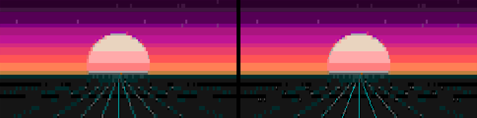

# KOAN.ansi

**Image & video → authentic BBS-scene ANSI art.** CP437 block glyphs, the DOS
16-color palette (iCE colors), and the half-block trick that doubles vertical
resolution — the real thing, not monochrome ASCII.

**▶ Use it in your browser — nothing to install:
<https://koan-shdw.github.io/koan-ansi/>**

Born from the old scene spirit: tools get released. ACiD lineage as the
quality bar.


*left: classic CP437 · right: extended (unicode quarter blocks)*

## What it does

- **Two charsets, chosen per render**
  - `classic` — pure CP437: `░ ▒ ▓ █ ▀ ▄ ▌ ▐` + space. Valid `.ans`, opens in
    ansilove / PabloDraw / any scene viewer.
  - `extended` — adds the unicode quadrant blocks `▘▝▖▗▚▞▙▛▜▟` for finer
    detail (modern terminals & web only).
  - `both` — renders the pair side by side into a compare PNG.
- **Two palettes** — `vga16` (authentic) or `truecolor` (exact colors, modern
  web look).
- **Video → Ansimation** — every frame converted on the same grid, written as
  one `.ansim` file a web player can loop (see format below).
- **Quality tricks** — per-cell quadrant matching, perceptual channel
  weighting, and a chroma-noise penalty that stops shade glyphs from dithering
  hue-clashing pairs (green dots on blue read as speckle, not as their mean).
  Optional Floyd–Steinberg mode.

## Install

```bash
git clone https://github.com/koan-shdw/koan-ansi
cd koan-ansi
pip install -e .
```

Python ≥ 3.10. Video input additionally needs `ffmpeg` on PATH.

## CLI

```bash
koan-ansi art.png                          # classic, 120 cols, all formats
koan-ansi art.png --charset both           # classic vs extended + compare png
koan-ansi art.png --palette truecolor      # modern smooth mode
koan-ansi art.png --dither fs --cols 80    # floyd–steinberg, narrower grid
koan-ansi --video clip.mp4 --video-fps 12 --id myloop   # → myloop.ansim
koan-ansi --frames-glob "frames/*.png" --fps 12 --id myloop
```

Outputs per run (where the mode allows):

| file | what |
|---|---|
| `*.ans` | real ANSI: CP437 bytes + SGR + SAUCE record, iCE colors |
| `*.json` / `*.ansim` | packed cell grid for web players (still / animated) |
| `*.preview.png` | 1:1 render — do **not** judge dither color on this |
| `*.preview-far.png` | half-scale through a real filter — judge THIS one |
| `*.txt` | UTF-8 ANSI — `cat` it in a modern terminal |

Useful knobs: `--cols` (grid width; height follows the 1:2 cell aspect),
`--noise-k` (anti-speckle strength, default 0.12), `--rows`, `--formats`,
`--author/--group` (SAUCE credits).

> Why two previews? Most image viewers alias an ordered dither when scaling —
> colors look wrong at 1:1 that are correct at viewing distance. The
> `preview-far` render averages the dither the way distance does.

## Web tool

Live at **<https://koan-shdw.github.io/koan-ansi/>** — drop / paste an
image, tune everything live, download all formats. Conversion runs entirely
client-side (a TypeScript port of the same matcher, verified to 99.8% cell
parity with the Python core). Source in [`web/`](web/):

```bash
cd web && npm install && npm run dev
```

## The Ansimation format (`.ansim`, v1)

Named after the scene's word for animated ANSI. One JSON object:

```jsonc
{
  "format": "ansimation/1",
  "id": "myloop",
  "title": "MYLOOP",
  "cols": 96,
  "rows": 48,
  "fps": 12,            // 0 = still
  "frames": [ [cell, cell, ...], ... ]   // each frame is cols*rows cells
}
```

Each cell is one integer: `(glyph << 8) | (fg << 4) | bg`, with `fg`/`bg`
indexing the DOS 16-color palette and `glyph` indexing the classic charset in
this order: space `░ ▒ ▓ █ ▀ ▄ ▌ ▐` (extended sets continue past index 8).
Still exports use the same payload with the `.json` extension.

A player redraws the grid each frame — blocks are pure geometry (rects + a
4×4 Bayer dither for shades), so no font asset is needed at any resolution.

## License

MIT © 2026 Alexander Mitchell (KOAN)

Respect to the ANSI scene — ACiD, iCE, and everyone who drew with blocks at
2400 baud.
